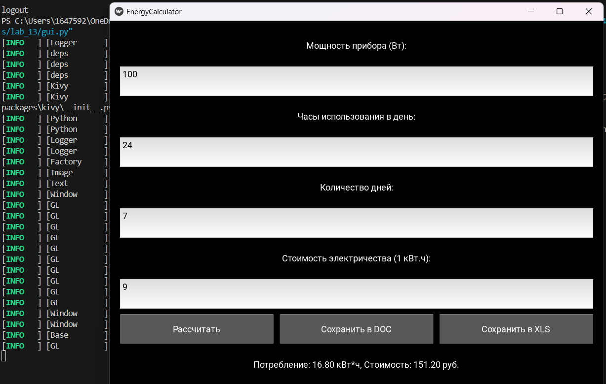
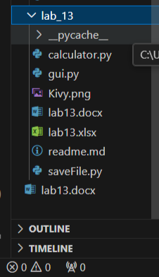

# Лабораторная работа №13
## Задание 
1. Переписать свой вариант лабораторной работы №12 с использованием классов и объектов.
## Вариант 3
# Код
```
from abc import ABC, abstractmethod
from weakref import WeakKeyDictionary
from kivy.app import App
from kivy.uix.boxlayout import BoxLayout
from kivy.uix.label import Label
from kivy.uix.textinput import TextInput
from kivy.uix.button import Button
from kivy.uix.popup import Popup
from calculator import calculate_energy_consumption, calculate_cost
from saveFile import save_to_doc, save_to_xls


# Абстрактный базовый класс для валидации
class Validator(ABC):
    @abstractmethod
    def validate(self, value):
        pass


# Дескриптор с валидацией
class ValidatedAttribute:
    def __init__(self, validator):
        self.validator = validator
        self.data = WeakKeyDictionary()

    def __get__(self, instance, owner):
        return self.data.get(instance, None)

    def __set__(self, instance, value):
        if self.validator.validate(value):
            self.data[instance] = value
        else:
            raise ValueError("Некорректное значение")


# Валидатор для числовых значений
class NumberValidator(Validator):
    def validate(self, value):
        try:
            float(value)
            return True
        except ValueError:
            return False


# Базовый класс для электроприборов
class ElectricalAppliance:
    power = ValidatedAttribute(NumberValidator())
    hours = ValidatedAttribute(NumberValidator())
    days = ValidatedAttribute(NumberValidator())
    rate = ValidatedAttribute(NumberValidator())

    def __init__(self, power=0, hours=0, days=0, rate=0):
        self.power = power
        self.hours = hours
        self.days = days
        self.rate = rate

    def __str__(self):
        return f"Прибор: {self.power}Вт, {self.hours}ч/день, {self.days}дней"

    def __repr__(self):
        return f"<ElectricalAppliance {self.power}W>"

    def calculate(self):
        energy = calculate_energy_consumption(
            float(self.power), 
            float(self.hours), 
            float(self.days)
        )
        cost = calculate_cost(energy, float(self.rate))
        return energy, cost


# Главное окно приложения
class ApplianceApp(BoxLayout):
    def __init__(self, **kwargs):
        super().__init__(**kwargs)
        self.orientation = 'vertical'
        self.spacing = 10
        self.padding = 20

        self.appliance = ElectricalAppliance()

        # Поля ввода
        self.add_widget(Label(text="Мощность прибора (Вт):"))
        self.power_input = TextInput(multiline=False)
        self.add_widget(self.power_input)

        self.add_widget(Label(text="Часы использования в день:"))
        self.hours_input = TextInput(multiline=False)
        self.add_widget(self.hours_input)

        self.add_widget(Label(text="Количество дней:"))
        self.days_input = TextInput(multiline=False)
        self.add_widget(self.days_input)

        self.add_widget(Label(text="Стоимость электричества (1 кВт.ч):"))
        self.rate_input = TextInput(multiline=False)
        self.add_widget(self.rate_input)

        # Кнопки
        btn_layout = BoxLayout(spacing=10)
        btn_calculate = Button(text="Рассчитать")
        btn_calculate.bind(on_press=self.calculate)
        btn_layout.add_widget(btn_calculate)

        btn_doc = Button(text="Сохранить в DOC")
        btn_doc.bind(on_press=self.save_doc)
        btn_layout.add_widget(btn_doc)

        btn_xls = Button(text="Сохранить в XLS")
        btn_xls.bind(on_press=self.save_xls)
        btn_layout.add_widget(btn_xls)

        self.add_widget(btn_layout)

        # Поле для вывода результата
        self.result_label = Label(text="Результат:")
        self.add_widget(self.result_label)

    def calculate(self, instance):
        try:
            self.appliance.power = self.power_input.text
            self.appliance.hours = self.hours_input.text
            self.appliance.days = self.days_input.text
            self.appliance.rate = self.rate_input.text

            energy, cost = self.appliance.calculate()
            self.result_label.text = f"Потребление: {energy:.2f} кВт*ч, Стоимость: {cost:.2f} руб."
        except ValueError as e:
            self.show_error(str(e))

    def save_doc(self, instance):
        if "Потребление:" in self.result_label.text:
            save_to_doc(self.result_label.text)
            self.show_popup("Результат сохранён в файл lab13.docx")

    def save_xls(self, instance):
        if "Потребление:" in self.result_label.text:
            save_to_xls(self.result_label.text)
            self.show_popup("Результат сохранён в файл lab13.xlsx")

    def show_error(self, message):
        popup = Popup(title='Ошибка',
                      content=Label(text=message),
                      size_hint=(None, None), size=(400, 200))
        popup.open()

    def show_popup(self, message):
        popup = Popup(title='Успешно',
                      content=Label(text=message),
                      size_hint=(None, None), size=(400, 200))
        popup.open()


# Главный класс приложения Kivy
class EnergyCalculatorApp(App):
    def build(self):
        return ApplianceApp()


if __name__ == '__main__':
    EnergyCalculatorApp().run()

```
### Изменения относительно ЛР 12
1. Добавлен абстрактный класс `Validator`
2. Добавлено наследование
3. Добавлены Managed-атрибуты через дескриптор `ValidatedAttribute`
4. Добавлены Dunder-методы в классе **ElectricalAppliance**: `__str__`, `__repr__`
## Скриншоты
***Работа программы***


***Сохранение файлов***
